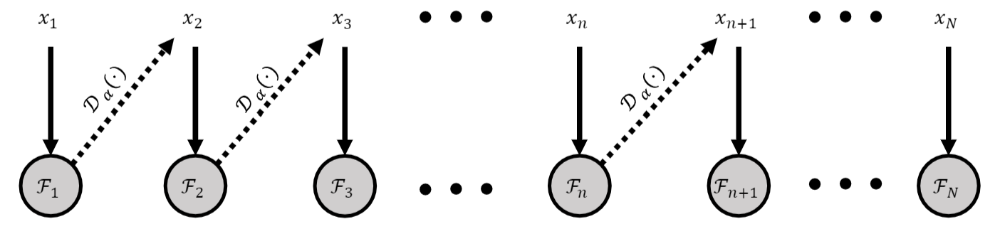

# 2PLD: Optimization of dose selection using multiple surrogates of toxicity as a continuous variable in Phase I cancer trial

## Contents
* [Overview](#Overview)
* [Introduction](#Introduction)
* [References](#References)

## Overview

The present work is the research when I was Pharmacometrics Intern at Pharmacometry Team at Merck Group, supervised by Kosalaram Goteti, Ph.D. This work has been accepted to [American Conference on Pharmacometrics 2020](https://www.go-acop.org/). Published poster article is [here](https://github.com/yain22/SWM/blob/main/Presentation/ACOP_Se_Yoon_Lee_PhD.pdf). 

## Introduction

For a phase I cancer clinical trial, the number of patients is sharply confined. For this reason, proper exploitation of toxicity information from each of the patients is crucial in designing an adaptive clinical trial. In such a phase I study we have to consider that treatment effect may not be known for months, possibly years, after enrollment: whereas, toxic reactions manifest in terms of days, weeks, or months rather than years. 

Because there is no immediate possibility of assessing the relative advantages of the treatment against its toxic disadvantages, the pharmacological underpinning of a new drug candidate mainly relies on a toxicity-dose curve which describes a relationship between toxicity and dose. The main goal of the phase I studies is to estimate the maximum tolerated dose (MTD), or the highest dose at which a pre-specified level of risk of toxicity is not exceeded.

In this study of simulation, we consider a fully sequential design setting where patients are introduced to the trials individually and sequentially, and each patient is assigned with an estimate of the MTD based on the accumulated patient’s information at interim. To protect patients from being overdosed, a drug is initiated at a very low dose and slowly escalated toward the targeted MTD as the trials go on. 

Two typical pioneering Bayesian adaptive designs for the phase I cancer clinical trials are (i) continual reassessment method (CRM) and (ii) escalation with overdose control (EWOC). Drawbacks of CRM and EWOC are as follows: (i) adverse event is recorded with a binary response: DLT (dose limiting toxicity) or non DLT and (ii) they cannot accommodate grade information for multiple adverse events (AE). To accommodate grade information from multiple AEs, recently, EWOC using normalized equivalent toxicity score (EWOC-NETS) was developed. Because EWOC-NETS is based on a pseudo-Bernoulli likelihood, its drawback is that the results cannot be reproduced by simulation. In this study, we propose a two- parameter linear dose-finder (2PLD) to address a continuous toxicity response in the phase I cancer clinical trials. The 2PLD assumes a linear relationship between a toxic reaction and a dosage (or possibly an exposure). 2PLD treats the toxicity response as a continuous variable, aimed at utilizing Common Toxicity Criteria for Adverse Events provided by the National Cancer Institute. The proposed search procedure suggests an optimal exposure to each patient by using accrued patient’s information while controlling the posterior probability of overdose.

The simulations show that this novel 2PLD method has good operating characteristics and improved accuracy in achieving MTD. Simulations showed that the 2PLD requires a fewer step to converge to the targeted MTD than using adaptive clinical trial design methods that are based on binary responses such as EWOC or CRM. This novel 2PLD can be an attractive tool for clinical scientists because of its parsimonious description of a toxicity-dose curve, medically interpretable hyperparameters, and an automated posterior computation.

## References

[1] Babb, James, André Rogatko, and Shelemyahu Zacks. "Cancer phase I clinical trials: efficient dose escalation with overdose control." Statistics in medicine 17.10 (1998): 1103-1120

[2] O'Quigley, John, Margaret Pepe, and Lloyd Fisher. "Continual reassessment method: a practical design for phase 1 clinical trials in cancer." Biometrics (1990): 33-48 

[3] Rosenblum, Michael, et al. "Adaptive design in surveys and clinical trials: similarities, differences and opportunities for cross‐fertilization." Journal of the Royal Statistical Society: Series A (Statistics in Society) 182.3 (2019): 963-982
